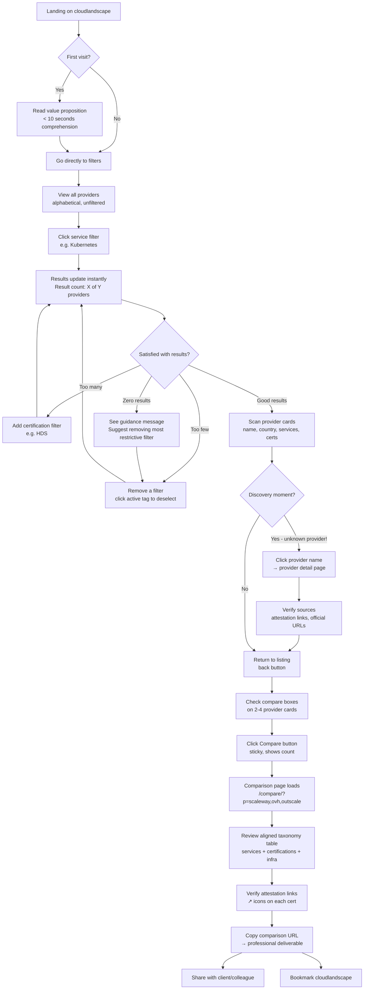
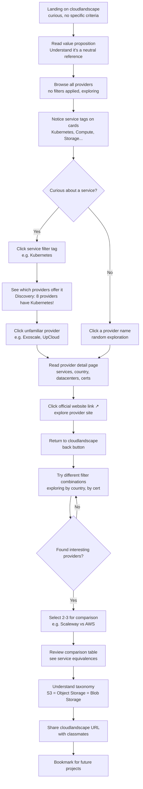
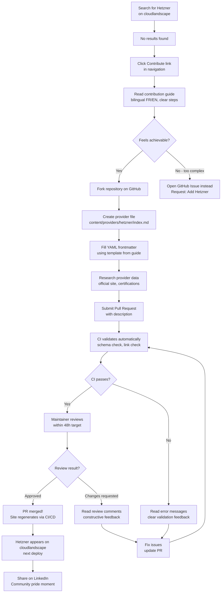

# UX Design Specification cloudlandscape

**Author:** nicolas
**Date:** 2026-02-24

---

<!-- UX design content will be appended sequentially through collaborative workflow steps -->

## Executive Summary

### Project Vision

cloudlandscape is an open-source, neutral reference platform that maps the global cloud provider ecosystem — with a focus on European providers and digital sovereignty. It eliminates the fragmented discoverability problem that forces IT architects to spend 2+ hours searching across biased blog posts, inconsistent marketing terminology, and scattered provider sites.

The platform provides a unified service taxonomy (S3 = Object Storage = Blob Storage), multi-criteria filtering (service type, certifications, geography), and side-by-side provider comparison — all in a static, performant, bilingual (FR/EN) website with zero commercial conflict of interest.

The core UX promise: reduce cloud provider discovery from 2+ hours of anxious, fragmented research to <10 minutes of confident, complete discovery.

### Target Users

**Primary — Jérôme (Architect/ESN):** Senior IT architect who needs to find compliant cloud providers matching specific technical and sovereignty criteria under time pressure. Desktop-first, technically proficient, needs confidence in completeness. Core task: filter → compare → shortlist in <10 minutes.

**Secondary — Sarah (DevOps Student):** Master's student exploring the cloud ecosystem beyond AWS/GCP/Azure. Curious, learning-oriented, uses both desktop and mobile. Discovers alternative providers and free certification programs.

**Tertiary — Marc (Community Contributor):** Freelance developer who notices missing providers and contributes via GitHub PR workflow. Needs clear templates, contribution guidelines, and fast maintainer feedback.

**Stakeholder — Lucie (Provider Representative):** Marketing manager at a cloud provider who wants to update or add her company's data. Needs an official channel for provider-validated updates.

**Operator — Nicolas (Maintainer):** Solo maintainer who reviews PRs in <15 minutes, maintains data quality, and ensures CI/CD pipeline health. Needs scalable validation workflows.

All users are technically intermediate to advanced, comfortable with Git, and read English technical content.

### Key Design Challenges

1. **Multi-criteria filtering without cognitive overload:** Combining Service + Certification + Country filters must feel natural and powerful without exposing complexity. The interface must communicate available filter combinations and result counts clearly.

2. **Dense comparison tables that remain readable:** Aligning services with different marketing names (S3 ≈ Object Storage ≈ Blob Storage) across 2-4 providers in a comparison table requires careful information density management — especially on smaller screens.

3. **Bilingual experience without friction:** FR/EN language switching must preserve user context (current page, active filters, comparison state). The user should never "lose their place" when switching languages.

4. **Progressive enhancement under strict performance budgets:** Core content must be fully accessible without JavaScript. Filters and comparison features enhance the experience but cannot gate access to provider information. DOM <1500 nodes, JS <100KB gzipped, page load <1.5s on 3G.

5. **Making contribution feel approachable:** The GitHub PR workflow is inherently technical. The contribution guide UX must make the process feel achievable and rewarding for first-time contributors.

### Design Opportunities

1. **Designed "aha!" moment:** The moment a user discovers a provider they didn't know about can be architecturally designed — through result count feedback, discovery indicators, and confident completeness signals.

2. **Shareable URLs as deliverables:** Comparison URLs (`/compare/?p=scaleway,ovh,outscale`) become professional artifacts that architects share with clients — the URL itself is the deliverable.

3. **Minimal design system as brand identity:** CSS vanilla with custom properties creates a distinctive, performant visual identity. The technical constraint becomes a design opportunity for cohesion and speed.

4. **Visual taxonomy language:** The unified service dictionary can be expressed through consistent iconography and category color coding, making cross-provider comparison instantly comprehensible.

5. **Accessibility as credibility signal:** RGAA 4 AA compliance is not just a requirement — it's a visible marker of quality and professionalism that reinforces the platform's neutrality and trustworthiness.

## Core User Experience

### Defining Experience

The core experience of cloudlandscape is a **Filter → Discover → Compare** loop that transforms fragmented cloud provider research into a confident, complete discovery process.

**Primary action:** Multi-criteria filtering (Service type + Certification + Country/Region). This is the most frequent user action and the interaction that must be flawless.

**Core loop:**
1. **Filter** — User selects criteria (1 click per filter). Results update instantly (<2 seconds).
2. **Discover** — User sees the filtered provider list refine in real-time. Each addition or removal of a filter criterion visibly changes the result set, giving the user a sense of direct control and progressive refinement.
3. **Compare** — User selects 2-4 providers for side-by-side comparison with aligned service taxonomy.
4. **Decide** — User has a confident shortlist backed by sourced, verifiable data.

**What makes this different:** Confidence comes from **sourced data**, not UI polish. Every certification has an attestation link. Every provider has official references. The user trusts the results because they can verify them — not because the interface tells them to.

### Platform Strategy

- **Platform:** Static web application (Multi-Page Application via Zola SSG)
- **Primary interaction:** Mouse/keyboard on desktop (professional context)
- **Secondary interaction:** Touch on mobile (discovery, sharing)
- **Offline:** Not required — content is static and cacheable via service worker if needed in future
- **Device capabilities:** No device-specific features required — pure web standards
- **Progressive enhancement:** All provider information accessible without JavaScript. Filtering and comparison features enhance the experience but never gate content access.

### Effortless Interactions

**Must be zero-thought:**
- **Page comprehension in <10 seconds** — First-time visitor understands what cloudlandscape does and how to use it without any instructions
- **Filter application in 1 click** — Each filter criterion is a single click/tap. No submit button, no form to fill. Results update immediately.
- **Comparison launch in 2 clicks** — Select providers → click compare. URL updates automatically for sharing.
- **Language switch preserves state** — Switching FR↔EN keeps the user on the same page with the same filters active. Zero context loss.
- **Source verification in 1 click** — Every certification and provider claim links directly to its official source

**Should feel invisible:**
- Filter result count updates as criteria change — the user always knows how many providers match
- Comparison URL is always shareable — no "generate link" step needed
- Bilingual content is structurally identical — same information architecture in both languages

### Critical Success Moments

**Make-or-break moment — First filtered results:**
When the user applies their first filter combination and sees results. This moment must deliver:
- Instant response (<2 seconds)
- Clear result count ("4 providers match your criteria")
- Visible provider cards with key information (name, country, matched services, certifications)
- If zero results: helpful guidance ("No providers match all criteria. Try removing [least restrictive filter]")

**Discovery moment — Finding the unknown:**
The user discovers a provider they didn't know about. This is the "aha!" moment that validates cloudlandscape's existence. The design must make discovery visible — not buried in a long list.

**Confidence moment — Trust through sources:**
The user sees that every data point is sourced and verifiable. Certification attestation links, official provider URLs, last-verified dates. The user's confidence grows not from the interface saying "trust us" but from the ability to **verify independently**. This is the moment the user bookmarks cloudlandscape.

**Sharing moment — URL as deliverable:**
The user copies a comparison URL (`/compare/?p=scaleway,ovh,outscale`) and sends it to a client or colleague. The URL reconstructs the exact comparison view. The shared link *is* the professional deliverable.

### Experience Principles

1. **Source-backed confidence** — Every claim is verifiable. Trust is earned through transparency, not authority. If data can't be sourced, it doesn't appear.

2. **Instant feedback, zero waiting** — Every user action produces immediate, visible results. Filters respond in <2 seconds. No loading spinners, no "please wait". The interface feels alive.

3. **Progressive refinement** — Users build their query incrementally. Each filter addition/removal visibly changes results. The user feels in control of a narrowing funnel, not lost in a complex search form.

4. **Content-first, JS-enhanced** — All provider information is accessible as static HTML. JavaScript adds filtering and comparison power but never gates access to content. The experience degrades gracefully.

5. **Neutrality by design** — No provider is visually privileged. No sponsored placements. Alphabetical default ordering. The design itself communicates the platform's independence.

## Desired Emotional Response

### Primary Emotional Goals

1. **Confidence through verifiability** — The dominant emotion. Users feel confident because every data point is sourced and independently verifiable. This is the emotion that drives return visits and bookmarking. Unlike biased blog posts or sponsored comparisons, cloudlandscape earns trust through radical transparency.

2. **Serenity of neutrality** — The differentiating emotion no competitor can replicate. Users feel serene knowing that no result is influenced by money, partnerships, or commercial interests. Alphabetical ordering, no visual privilege, no sponsored placements — the design itself communicates independence.

3. **Control through progressive refinement** — Users feel empowered and in command as they build their query incrementally. Each filter click produces immediate visible change. The user steers the search, never the system.

### Emotional Journey Mapping

| Stage | Before cloudlandscape | During | After |
|-------|----------------------|--------|-------|
| **Emotion** | Anxiety, frustration, impuissance | Clarity → Control → Surprise → Confidence → Efficiency | Relief, legitimacy, sharing impulse |
| **Trigger** | Fragmented research, biased sources, marketing noise | Instant comprehension, responsive filters, provider discovery, source links, comparison table | Complete shortlist, verifiable data, shareable URL |
| **Design response** | — | Clean layout, instant feedback, discovery visibility, attestation links, aligned taxonomy | Bookmark prompt, copy URL, contribution invitation |

**Detailed emotional arc:**
- **First visit (0-10s):** Clarity — "I understand what this is and how to use it" (clean layout, clear value proposition)
- **First filter (10-30s):** Control — "I'm piloting my search" (instant response, result count, visible refinement)
- **Discovery moment (30-60s):** Positive surprise — "I didn't know about this provider!" (discovery made visible, not buried)
- **Source verification (1-2min):** Deep confidence — "Everything is verifiable, I can trust this" (attestation links, official URLs, last-verified dates)
- **Comparison (2-5min):** Professional efficiency — "I have my argued shortlist" (aligned taxonomy, certification matrix, shareable URL)
- **Task completion (5-10min):** Relief + legitimacy — "I've covered the market, I can defend my choice" (completeness signal, professional deliverable)
- **Post-visit:** Sharing impulse — "My colleague needs to know about this" (easy URL sharing, word-of-mouth trigger)

### Micro-Emotions

**Critical micro-emotions to cultivate:**
- **Confidence over confusion** — Every interaction confirms the user is on the right path. Clear labels, predictable behavior, consistent patterns.
- **Trust over skepticism** — Sourced data, attestation links, and neutral presentation eliminate doubt. No marketing language, no superlatives.
- **Accomplishment over frustration** — Task completion feels earned and complete. The user knows they've covered the market, not just found "a result."
- **Belonging over isolation** — Contributors feel part of a meaningful community. Their contributions are visible, acknowledged, and impactful (Marc's LinkedIn post moment).

**Micro-emotions to prevent:**
- **Never anxiety** from empty results — Zero-result states provide actionable guidance, not dead ends
- **Never doubt** about data completeness — Clear signals about data freshness and coverage
- **Never suspicion** about neutrality — No visual hierarchy that could suggest preference or sponsorship
- **Never overwhelm** from information density — Progressive disclosure, focused views, manageable comparison limits (2-4 providers)

### Design Implications

| Emotional Goal | UX Design Approach |
|---------------|-------------------|
| Confidence through verifiability | Every certification shows attestation link icon. Provider cards display "last verified" date. Official source URLs are prominent, not hidden. |
| Serenity of neutrality | Alphabetical default sort. No "featured" or "recommended" badges. Equal visual weight for all providers. No ads, no affiliate indicators. |
| Control through refinement | Filters update results instantly. Active filter count visible. Result count always displayed. Clear "reset all" affordance. |
| Positive surprise (discovery) | Result count changes visibly when filters change. New-to-user providers are not de-emphasized. Discovery is architecturally possible through broad taxonomy. |
| Professional efficiency | Comparison URLs are auto-generated and copyable. Comparison tables use aligned taxonomy. Export-ready layouts for professional contexts. |
| Community belonging | Contributor names visible in git history. Contribution guide is welcoming and clear. PR feedback is fast and constructive. |

### Emotional Design Principles

1. **Transparency generates trust** — Show sources, show dates, show methodology. Never ask users to "trust us" — let them verify. Every design decision that increases transparency increases the core emotional response.

2. **Silence communicates neutrality** — What we *don't* show is as important as what we show. No badges, no rankings, no "editor's choice." The absence of commercial noise is itself an emotional signal of integrity.

3. **Speed communicates respect** — Instant filter responses, fast page loads, no unnecessary animations. Respecting the user's time is an emotional act — it says "we value your minutes."

4. **Guidance over dead ends** — Error states and empty results are opportunities for helpfulness, not frustration. Every "no result" message includes a constructive next step. The user never feels abandoned.

5. **Community pride through visibility** — Contributors see their impact. Provider data credits the community. The emotional reward of contributing is seeing your work help others discover cloud alternatives.

## UX Pattern Analysis & Inspiration

### Inspiring Products Analysis

**CNCF Landscape** — The closest reference in domain and purpose
- ✅ Exhaustive ecosystem mapping with visual density that works
- ✅ Interactive zoom: thematic grouping → category → individual projects — progressive disclosure at its finest
- ✅ Filter by category, license, organization — multi-criteria without complexity
- ✅ Visual cards with logos create instant recognition and scanability
- ⚠️ Can feel overwhelming on first visit — information density is high
- ⚠️ Requires learning curve to understand grouping logic
- **Key lesson for cloudlandscape:** The zoom/grouping model proves that large datasets can be navigable. But cloudlandscape must achieve clarity faster (<10 seconds) than CNCF Landscape does.

**GitHub** — The daily tool of the target audience
- ✅ Core features (repos, issues, PRs) are intuitive without documentation
- ✅ Progressive complexity — basic usage requires zero learning, power features reveal themselves over time
- ✅ Consistent patterns across the entire platform — once you learn one page, you know them all
- ✅ Clean information hierarchy with clear typography and whitespace
- **Key lesson for cloudlandscape:** GitHub proves that technical audiences value consistency and predictability over visual flair. The same page structure should work for every provider.

**Reddit** — Fast, accessible search
- ✅ Search-first architecture — the search bar is prominent and instantly accessible
- ✅ Results appear fast with clear categorization (posts, communities, users)
- ✅ Minimal visual noise — content is king, chrome is minimal
- **Key lesson for cloudlandscape:** Search prominence and speed. The filter/search mechanism should feel as immediate as Reddit's search bar.

**StackOverflow** — Rapid information retrieval
- ✅ Answers are immediately visible — no click-through required
- ✅ Structured, scannable content (code blocks, headers, vote counts)
- ✅ Tags system for instant categorization — users understand tag-based filtering intuitively
- **Key lesson for cloudlandscape:** Tag/taxonomy-based filtering is a pattern the target audience already knows from StackOverflow. Service types and certifications should feel like familiar tags.

**man7.org / Wikipedia / tldr.sh / devhints.io** — The simplicity quartet
- ✅ Content loads instantly — near-zero page weight
- ✅ No distractions — pure information, no ads, no modals, no cookie banners
- ✅ Typography-driven design — the content IS the design
- ✅ devhints.io specifically: modern, clean, card-based layout with excellent information density
- ✅ tldr.sh: proves that "less is more" — essential information only, no bloat
- **Key lesson for cloudlandscape:** Performance IS UX. These sites prove that fast + simple + clean beats feature-rich + slow every time. This aligns perfectly with the Zola SSG + vanilla CSS constraints.

### Transferable UX Patterns

**Navigation Patterns:**
- **Tag-based filtering** (StackOverflow model) — Service types, certifications, and countries presented as clickable tags. Users already understand this mental model from daily tool usage.
- **Consistent page structure** (GitHub model) — Every provider page follows the exact same layout. Once you've seen one, you know them all. Zero learning curve for subsequent providers.
- **Progressive disclosure** (CNCF Landscape model) — Overview → filtered list → provider detail → comparison. Each level adds depth without overwhelming.

**Interaction Patterns:**
- **Instant search/filter feedback** (Reddit/StackOverflow model) — Results update as the user types or clicks. No "submit" button, no loading page. The interface feels alive and responsive.
- **Visible result count** (GitHub model) — "4 providers match" — always visible, updates in real-time as filters change. The user always knows the scope of their results.
- **Tag removal by click** (StackOverflow model) — Active filters displayed as removable tags above results. One click to remove a criterion. Visual representation of the active query.

**Visual Patterns:**
- **Typography-first design** (man7.org/Wikipedia model) — Content readability over visual decoration. Clean fonts, generous line-height, sufficient contrast. The content is the hero.
- **Card-based overview** (devhints.io/CNCF model) — Provider cards with logo, name, country, key services. Scannable grid layout that works on all screen sizes.
- **Minimal chrome** (tldr.sh model) — Navigation, content, footer. Nothing else. Every pixel serves information delivery.

**Data Display Patterns:**
- **Structured content blocks** (StackOverflow model) — Provider data displayed in consistent, scannable blocks: services section, certifications section, geographic section. Headers create visual anchoring.
- **Comparison via aligned columns** (CNCF Landscape filter model) — Side-by-side provider comparison with taxonomy-aligned rows. Service equivalences visible through row alignment.

### Anti-Patterns to Avoid

- ❌ **CNCF Landscape initial overwhelm** — Don't show everything at once. cloudlandscape must be comprehensible in <10 seconds, not minutes. Start with clear filters, not a wall of logos.
- ❌ **Cookie consent modals/banners** — No tracking, no cookies needed. Zero interruption on first visit. The user goes straight to content.
- ❌ **"Featured" or "trending" sections** — Conflicts directly with neutrality principle. No provider gets visual priority based on popularity or recency.
- ❌ **Heavy onboarding flows** — Target users are technical and impatient. No tutorials, no walkthroughs, no "getting started" modals. The interface should be self-explanatory.
- ❌ **Pagination for small datasets** — With 10-50 providers, show all results on one page. Pagination adds unnecessary clicks for a dataset this size.
- ❌ **Loading spinners and skeleton screens** — With a static site and inline JSON, there should be nothing to "load". If the user sees a spinner, something is wrong.
- ❌ **Marketing language in UI** — No "discover amazing providers" or "unlock the power of cloud". Technical audience, technical language. Clean, factual, direct.

### Design Inspiration Strategy

**What to Adopt directly:**
- **Tag-based filtering** (StackOverflow) — Service types, certifications, countries as clickable, removable tags
- **Instant result feedback** (Reddit) — Real-time result count and list updates on every filter change
- **Typography-first design** (Wikipedia/man7.org/tldr.sh) — Content readability as primary design principle
- **Consistent page structure** (GitHub) — Every provider page identical in layout
- **Zero-distraction interface** (tldr.sh/devhints.io) — No ads, no modals, no unnecessary chrome

**What to Adapt:**
- **CNCF card grid** → Adapt for provider cards with certification badges and service tags instead of project logos and maturity levels
- **devhints.io card density** → Adapt the clean, modern card layout for provider overview while respecting DOM <1500 nodes constraint
- **GitHub's progressive complexity** → Basic filtering is obvious; comparison feature reveals itself naturally when 2+ providers are selected

**What to Avoid:**
- CNCF's initial visual density → Start filtered/clean, not "everything at once"
- Any pattern requiring user accounts or preferences storage for core functionality
- Any interaction pattern requiring more than 2 clicks to reach a result

## Design System Foundation

### Design System Choice

**Custom Design System "Typography-First"** — A lightweight, hand-crafted design system built entirely with CSS vanilla and custom properties. No framework, no preprocessor, no build step for styles.

This choice is not a compromise — it is the optimal solution given the project's architectural constraints (Zola SSG, no npm, CSS <50KB budget) and aligns perfectly with the inspiration analysis (devhints.io, tldr.sh, Wikipedia simplicity).

### Rationale for Selection

1. **Architecture alignment** — ADR-05 mandates CSS custom properties + utility-light approach. No CSS framework or preprocessor. The design system must be pure CSS vanilla.
2. **Performance by design** — No framework overhead. Every CSS rule is intentional. Budget <50KB is achievable with a focused component set.
3. **Maintainability** — A solo maintainer can understand and modify every line. No abstraction layers, no build pipeline for styles, no dependency updates.
4. **Inspiration match** — The target aesthetic (devhints.io clarity, tldr.sh minimalism, Wikipedia readability) is best achieved with typography-driven CSS, not component library defaults.
5. **Dark mode ready** — Custom properties architecture makes future dark mode implementation straightforward via `prefers-color-scheme` media query and a secondary token set.

### Implementation Approach

**CSS File Architecture** (loaded in order):

```
static/css/
├── variables.css      → Design tokens (colors, spacing, typography, breakpoints)
├── base.css           → Reset, typography, links, focus-visible, semantic defaults
├── layout.css         → Page grid, containers, responsive breakpoints
├── components.css     → Provider card, filter panel, comparison table, tags, badges
└── utilities.css      → Minimal utility classes (spacing, visibility, text alignment)
```

**Design Tokens (Custom Properties):**

```css
:root {
  /* Color palette — Pastel, professional, accessible */
  --color-primary: #4A6FA5;        /* Muted blue — trust, technology */
  --color-primary-light: #D6E4F0;  /* Pastel blue — backgrounds, hover states */
  --color-primary-dark: #2D4A6F;   /* Deep blue — text emphasis, active states */

  --color-secondary: #6B9080;      /* Sage green — sovereignty, European identity */
  --color-secondary-light: #D8E8E0; /* Pastel green — certification badges */

  --color-accent: #E8A87C;         /* Warm peach — discovery moments, CTAs */
  --color-accent-light: #F5DCC8;   /* Light peach — subtle highlights */

  --color-neutral-50: #FAFBFC;     /* Near-white — page background */
  --color-neutral-100: #F0F2F5;    /* Light grey — card backgrounds */
  --color-neutral-200: #D9DEE4;    /* Border grey — dividers, borders */
  --color-neutral-300: #B0B8C4;    /* Muted grey — secondary text, icons */
  --color-neutral-600: #4A5568;    /* Dark grey — body text */
  --color-neutral-800: #1A202C;    /* Near-black — headings */

  --color-success: #6B9080;        /* Reuse sage green — certification present */
  --color-warning: #E8A87C;        /* Reuse peach — attention needed */
  --color-error: #C27171;          /* Muted red — errors, broken links */

  --color-bg: var(--color-neutral-50);
  --color-surface: #FFFFFF;
  --color-text: var(--color-neutral-600);
  --color-heading: var(--color-neutral-800);

  /* Typography */
  --font-family-base: system-ui, -apple-system, 'Segoe UI', Roboto, sans-serif;
  --font-family-mono: 'JetBrains Mono', 'Fira Code', ui-monospace, monospace;
  --font-size-xs: 0.75rem;    /* 12px — labels, metadata */
  --font-size-sm: 0.875rem;   /* 14px — secondary text, tags */
  --font-size-base: 1rem;     /* 16px — body text */
  --font-size-lg: 1.125rem;   /* 18px — lead text */
  --font-size-xl: 1.5rem;     /* 24px — section headings */
  --font-size-2xl: 2rem;      /* 32px — page titles */
  --line-height-tight: 1.25;
  --line-height-base: 1.6;
  --font-weight-normal: 400;
  --font-weight-medium: 500;
  --font-weight-bold: 700;

  /* Spacing (4px base unit) */
  --spacing-1: 0.25rem;   /* 4px */
  --spacing-2: 0.5rem;    /* 8px */
  --spacing-3: 0.75rem;   /* 12px */
  --spacing-4: 1rem;      /* 16px */
  --spacing-6: 1.5rem;    /* 24px */
  --spacing-8: 2rem;      /* 32px */
  --spacing-12: 3rem;     /* 48px */
  --spacing-16: 4rem;     /* 64px */

  /* Borders — Sharp corners, no border-radius */
  --border-radius: 0;
  --border-width: 1px;
  --border-color: var(--color-neutral-200);

  /* Shadows (subtle, pastel-friendly) */
  --shadow-sm: 0 1px 2px rgba(0, 0, 0, 0.05);
  --shadow-md: 0 2px 8px rgba(0, 0, 0, 0.08);

  /* Breakpoints (used in media queries, not as properties) */
  /* Mobile: <768px | Tablet: 768-1023px | Desktop: ≥1024px */

  /* Transitions */
  --transition-fast: 150ms ease;
  --transition-base: 250ms ease;
}
```

**Color accessibility validation:**
- `--color-neutral-600` (#4A5568) on `--color-neutral-50` (#FAFBFC) → contrast ratio ~7:1 ✅ (AA normal text)
- `--color-neutral-800` (#1A202C) on `--color-surface` (#FFFFFF) → contrast ratio ~16:1 ✅ (AAA)
- `--color-primary` (#4A6FA5) on `--color-surface` (#FFFFFF) → contrast ratio ~4.7:1 ✅ (AA normal text)
- All pastel backgrounds used for decorative/non-text purposes only, or with dark text overlay

### Customization Strategy

**Component inventory (MVP):**

| Component | CSS Class | Purpose |
|-----------|-----------|---------|
| Provider Card | `.provider-card` | Grid item in provider listing — name, country, services, certifications |
| Filter Panel | `.filter-panel` | Sidebar/top filter area with tag groups |
| Filter Tag | `.filter-tag` | Clickable/removable filter criterion |
| Active Filter | `.filter-tag.is-active` | Currently applied filter (pastel background) |
| Result Counter | `.result-count` | "X providers match" live counter |
| Comparison Table | `.compare-table` | Side-by-side provider comparison |
| Certification Badge | `.cert-badge` | SecNumCloud/HDS/EUCS indicator with attestation link |
| Service Tag | `.service-tag` | Service type indicator (Compute, Database, etc.) |
| Language Switcher | `.lang-switch` | FR/EN toggle |
| Skip Navigation | `.skip-nav` | Accessibility skip link |
| Empty State | `.empty-state` | Zero results guidance message |

**Naming conventions:**
- Component classes: `.provider-card`, `.filter-panel`, `.compare-table` (kebab-case with component prefix)
- State classes: `.is-active`, `.is-loading`, `.is-error`, `.is-empty` (`.is-*` prefix)
- Custom properties: `--color-*`, `--spacing-*`, `--font-*` (semantic namespaces)

**Visual tone:**
- Pastel color palette creates a warm, approachable, professional atmosphere
- Muted blue (trust, technology) as primary
- Sage green (sovereignty, European identity) as secondary
- Warm peach (discovery, action) as accent
- Generous whitespace and line-height for a clean, aéré feel
- System fonts for performance — no web font loading delay
- Subtle shadows and sharp corners for a clean, technical aesthetic
- No gradients, no animations beyond basic transitions

**Dark mode preparation (post-MVP):**
- All colors defined as custom properties → simply override in `@media (prefers-color-scheme: dark)` block
- Semantic color naming (`--color-bg`, `--color-surface`, `--color-text`) enables theme switching
- No hardcoded colors anywhere in component CSS

## Defining Core Experience

### Defining Experience

**The One-Sentence Experience:** "Filter by what you need, see who matches, verify with sources, compare side-by-side."

This is a **Search → Refine → Verify → Compare** pattern using exclusively established UX patterns that the target audience (architects, devs, SRE) already knows from StackOverflow tags, GitHub filters, and CNCF Landscape categories. No user education needed — zero learning curve.

**What the user tells their colleague:**
"Tu vas sur cloudlandscape, tu coches Kubernetes + HDS + France, et en 2 secondes t'as ta liste. Tout est sourcé. Tu peux comparer côte à côte."

### User Mental Model

**How users currently solve this problem:**
- Google "cloud provider HDS France" → biased blog posts, outdated articles
- Ask colleagues on Slack/Teams → incomplete, dependent on individual experience
- Visit individual provider websites → time-consuming, incomparable terminology
- Consult analyst reports (Gartner, Forrester) → expensive, US-centric, not neutral

**Mental model users bring:**
- "Filtering" = StackOverflow tags, GitHub issue labels, e-commerce faceted search
- "Comparison" = PCPartPicker, product comparison sites, spreadsheet columns
- "Reference" = Wikipedia, MDN, man pages — authoritative, factual, no opinion
- "Trust" = open-source, visible methodology, verifiable sources

**Where confusion could happen:**
- Service taxonomy mapping — "Is KaaS the same as Managed Kubernetes?" → Clear labels and tooltips needed
- Certification scope — "Does SecNumCloud cover all their services?" → Certification badges must link to attestation scope
- Data freshness — "Is this still current?" → Last-verified dates must be visible

**What users hate about current solutions:**
- Marketing language disguised as comparison
- Sponsored results they can't distinguish from organic
- Outdated information with no update date
- Incomparable terminology across providers

### Success Criteria

| Criterion | Target | Measurement |
|-----------|--------|-------------|
| Time to first meaningful result | <10 seconds after landing | From page load to first filter applied and results visible |
| Filter response time | <2 seconds | From click/tap to results updated |
| Page comprehension | <10 seconds | First-time visitor understands purpose and how to use filters |
| Discovery rate | >70% of users find ≥1 unknown provider | Post-session survey or inferred from click patterns |
| Source verification accessibility | 1 click | From any data claim to its official source |
| Comparison generation | <3 clicks | From filtered results to side-by-side comparison view |
| Task completion confidence | "I've covered the market" | User feels completeness, not just "I found a result" |

**Users feel successful when:**
- The result count gives them confidence they've seen all options
- Every data point has a verifiable source link
- They can share a comparison URL that reconstructs the exact view
- The entire process takes <10 minutes vs 2+ hours of manual research

### Novel UX Patterns

**Pattern type: Established patterns, combined with a unique trust layer.**

All individual interaction patterns are well-known to the target audience:
- Tag-based filtering → StackOverflow
- Instant result updates → GitHub, Reddit
- Side-by-side comparison → PCPartPicker, product sites
- Card-based listings → CNCF Landscape, devhints.io

**The novel combination — "Verifiable Neutrality":**
What makes cloudlandscape unique is not any single interaction, but the pervasive trust layer:
- Every data point links to its official source (not just "Source: provider website" but the specific attestation page)
- Alphabetical default ordering with no visual privilege — the design itself signals neutrality
- No tracking, no cookies, no analytics — the user *feels* the absence of surveillance
- Open-source data — anyone can verify the methodology by reading the YAML files

This trust layer is not a feature — it's a design philosophy expressed through every micro-interaction.

### Experience Mechanics

**1. Initiation — Landing on cloudlandscape:**
- User sees: clean header, brief value proposition ("Discover cloud providers. Neutral. Sourced. Open."), filter panel, full provider list (alphabetical)
- All providers visible by default — filters narrow, not search
- Filter panel is immediately visible (not hidden behind a button) on desktop, collapsible on mobile
- No onboarding, no modal, no cookie banner — straight to content

**2. Interaction — Filtering:**
- User clicks a service tag (e.g., "Kubernetes") → tag becomes `.is-active` (pastel background)
- Result count updates instantly: "4 providers match"
- Provider cards not matching fade or hide (CSS transition, `--transition-fast`)
- User adds another filter (e.g., "HDS") → result count drops: "3 providers match"
- Active filters displayed as removable tags above results
- "Reset all" link visible when any filter is active
- URL updates with query parameters (`?services=kubernetes&certs=hds`) — shareable at any point

**3. Feedback — Trust signals:**
- Each provider card shows: name, country flag, matched services (highlighted), certifications with attestation link icons
- "Last verified: Jan 2026" visible on each card
- Clicking a certification badge → opens attestation page in new tab
- Clicking a provider name → navigates to detailed provider page
- If zero results: helpful message with suggestion to remove the most restrictive filter

**4. Comparison — Side-by-side:**
- Checkbox on each provider card: "Compare"
- When 2+ providers checked, "Compare (3)" button appears (sticky on scroll)
- Click "Compare" → navigates to `/compare/?p=scaleway,ovh,outscale`
- Comparison page: aligned service taxonomy rows, certification matrix, geographic coverage
- Each cell is verifiable (attestation links)
- "Copy comparison URL" button for sharing

**5. Completion — Confidence signal:**
- Result count always visible ("4 of 12 providers match your criteria")
- The denominator ("of 12") tells the user: "you've seen the full market"
- After visiting comparison page, user can bookmark or share the URL
- No "sign up to save" — the URL *is* the save

## Visual Design Foundation

### Color System

**Palette Identity: "Pastel Professional"**

The color palette communicates trust (muted blue), European sovereignty (sage green), and discovery (warm peach) through soft, pastel tones. The overall impression is approachable, modern, and calm — the visual opposite of aggressive marketing and flashy tech interfaces.

**Semantic Color Map:**

| Role | Token | Value | Usage |
|------|-------|-------|-------|
| Primary | `--color-primary` | #4A6FA5 | Links, active elements, primary actions |
| Primary Light | `--color-primary-light` | #D6E4F0 | Active filter backgrounds, hover states |
| Primary Dark | `--color-primary-dark` | #2D4A6F | Text emphasis, visited links |
| Secondary | `--color-secondary` | #6B9080 | Certification badges, sovereignty indicators |
| Secondary Light | `--color-secondary-light` | #D8E8E0 | Certification badge backgrounds |
| Accent | `--color-accent` | #E8A87C | Discovery highlights, comparison CTA |
| Accent Light | `--color-accent-light` | #F5DCC8 | Subtle attention markers |
| Background | `--color-bg` | #FAFBFC | Page background |
| Surface | `--color-surface` | #FFFFFF | Card backgrounds, elevated surfaces |
| Text | `--color-text` | #4A5568 | Body text |
| Heading | `--color-heading` | #1A202C | Headings, strong emphasis |
| Border | `--color-neutral-200` | #D9DEE4 | Dividers, card borders |
| Muted | `--color-neutral-300` | #B0B8C4 | Secondary text, metadata, icons |
| Error | `--color-error` | #C27171 | Broken links, validation errors |

**Color usage rules:**
- Pastel backgrounds (`*-light` variants) are decorative only — never used as text backgrounds without dark text overlay
- Primary color used sparingly for interactive elements — not for decoration
- Neutral scale carries 90% of the visual weight — colors are accents, not themes
- No color conveys meaning alone — always paired with text or icon (accessibility)

### Typography System

**Font Strategy: System-first, zero-latency**

| Role | Token | Stack | Usage |
|------|-------|-------|-------|
| Body | `--font-family-base` | system-ui, -apple-system, 'Segoe UI', Roboto, sans-serif | All body text, labels, navigation |
| Code | `--font-family-mono` | 'JetBrains Mono', 'Fira Code', ui-monospace, monospace | Service names, technical identifiers, YAML examples |

**Rationale:** System fonts load instantly (0ms FOIT), look native on every OS, and support all languages needed (FR/EN). No web font dependency = no layout shift, no bandwidth cost, no GDPR font-loading consent issues.

**Type Scale (Major Third — 1.25 ratio):**

| Level | Token | Size | Weight | Line-height | Usage |
|-------|-------|------|--------|-------------|-------|
| Display | `--font-size-2xl` | 2rem (32px) | 700 | 1.25 | Page titles only (homepage, provider name) |
| H2 | `--font-size-xl` | 1.5rem (24px) | 700 | 1.25 | Section headings |
| Lead | `--font-size-lg` | 1.125rem (18px) | 400 | 1.6 | Introductory paragraphs, card descriptions |
| Body | `--font-size-base` | 1rem (16px) | 400 | 1.6 | Default body text |
| Small | `--font-size-sm` | 0.875rem (14px) | 400 | 1.6 | Tags, badges, metadata, filter labels |
| Caption | `--font-size-xs` | 0.75rem (12px) | 400 | 1.6 | Timestamps, "last verified" dates, fine print |

**Typography rules:**
- Maximum 3 font weights used: 400 (normal), 500 (medium for tags), 700 (bold for headings)
- Line-height 1.6 for all reading text — generous for scanability
- Line-height 1.25 for headings — tighter for visual impact
- No italic for emphasis — use `font-weight: 500` or color instead
- Monospace font for service taxonomy terms in inline contexts

### Spacing & Layout Foundation

**Spacing System: 4px base unit**

All spacing values are multiples of 4px, creating a consistent visual rhythm:

| Token | Value | Usage |
|-------|-------|-------|
| `--spacing-1` | 4px | Tight: tag padding, badge internal spacing |
| `--spacing-2` | 8px | Compact: between tags, inline elements |
| `--spacing-3` | 12px | Default: component internal padding |
| `--spacing-4` | 16px | Standard: between content blocks |
| `--spacing-6` | 24px | Comfortable: between sections within a card |
| `--spacing-8` | 32px | Spacious: between components (card to card) |
| `--spacing-12` | 48px | Section: between major page sections |
| `--spacing-16` | 64px | Page: top/bottom page margins |

**Layout Grid:**

| Breakpoint | Columns | Gutter | Container max-width | Behavior |
|-----------|---------|--------|---------------------|----------|
| Mobile (<768px) | 1 | 16px | 100% - 32px padding | Single column, stacked |
| Tablet (768-1023px) | 2 | 24px | 720px | Two-column card grid |
| Desktop (≥1024px) | 3 | 24px | 1200px | Three-column card grid + sidebar filter |

**Layout principles:**
- **Content-width max 1200px** — prevents ultra-wide line lengths, maintains readability
- **Filter panel:** Left sidebar on desktop (240px fixed), collapsible top panel on mobile/tablet
- **Provider cards:** Equal-width grid items, consistent height within rows
- **Comparison table:** Full container width, horizontal scroll on mobile if needed
- **Generous vertical spacing** — page sections breathe with `--spacing-12` gaps
- **No fixed heights** — all components expand naturally with content

### Accessibility Considerations

**Color Accessibility:**
- All text colors validated for WCAG 2.1 AA contrast on their intended backgrounds
- Color is never the sole indicator of state — always paired with text, icon, or border change
- Active filter state: pastel background + border change + text label (triple signal)
- Focus indicators: 2px solid `--color-primary` outline, 2px offset — visible on all backgrounds

**Typography Accessibility:**
- Minimum body text: 16px (1rem) — no text smaller than 12px anywhere
- Line-height 1.6 for body text — exceeds WCAG recommended minimum
- Font-weight contrast between headings (700) and body (400) — clear hierarchy without relying on size alone
- `lang` attribute on `<html>` ensures correct screen reader pronunciation (FR vs EN)

**Interaction Accessibility:**
- Touch targets: minimum 44×44px on mobile (per WCAG 2.5.5)
- Focus order follows visual reading order (left-to-right, top-to-bottom)
- `:focus-visible` styled in `base.css` — no `outline: none` without replacement
- Skip navigation link as first focusable element
- `aria-live="polite"` on result count and provider list container

**Motion & Reduced Motion:**
- Only transition used: `--transition-fast` (150ms) for filter state changes
- `@media (prefers-reduced-motion: reduce)` disables all transitions
- No animations, no parallax, no auto-playing content

## Design Direction Decision

### Design Directions Explored

Six design directions were created and evaluated through an interactive HTML showcase (`ux-design-directions.html`):

- **Direction A** — Sidebar + Cards Grid (CNCF/GitHub inspired)
- **Direction B** — Top Filters + Dense List (GitHub Issues/StackOverflow inspired)
- **Direction C** — Wikipedia Minimal (Wikipedia/man7.org inspired)
- **Direction D** — devhints-Inspired Cards (devhints.io inspired)
- **Direction E** — Comparison-First Table (PCPartPicker inspired)
- **Direction F** — Mobile-First Compact (mobile patterns)

### Chosen Direction

**Hybrid approach combining three directions for different contexts:**

| Context | Direction | Rationale |
|---------|-----------|-----------|
| **Desktop listing** | **A — Sidebar + Cards** | Clear header that maximizes space for data. Sidebar accommodates growing service taxonomy without redesign. Cards provide scannable provider overview. |
| **Comparison page** | **E — Comparison Table** | Simple, clear, elegant. Taxonomy-aligned rows handle a wide range of services naturally. Users are already familiar with this comparison pattern from product sites and spreadsheets. |
| **Mobile** | **F — Compact Stacked** | Horizontal scroll filter bar, stacked cards, hamburger navigation. Touch-optimized for Sarah's on-the-go discovery. |

### Design Rationale

1. **Sidebar scales with taxonomy growth** — As cloudlandscape adds services beyond the MVP 8 (Compute, Database, Storage, KaaS, PaaS, CaaS, IAM, API Gateway), the sidebar absorbs new filter groups without layout changes. Top-bar filters (Direction B) would overflow and require rethinking.

2. **Cards + Table duality** — Provider listing uses cards for scanability and visual warmth (logos, flags, badges). Comparison uses a table for precision and alignment. Each format serves its purpose — cards for discovery, table for decision-making.

3. **Consistent across breakpoints** — Desktop sidebar collapses to mobile horizontal scroll. Cards stack naturally. Comparison table gets horizontal scroll on mobile. No layout redesign needed per breakpoint — just CSS adaptation.

4. **Header stays minimal** — Direction A's header (logo + nav + lang switch) leaves maximum viewport for provider data. No hero sections, no marketing banners, no wasted vertical space.

### Implementation Approach

**Page templates and their design direction:**

| Page | Template | Design Direction | Key Components |
|------|----------|-----------------|----------------|
| Homepage | `index.html` | A (simplified) | Value proposition + full provider listing with sidebar filters |
| Provider listing | `providers/section.html` | A | Sidebar filters + card grid + result count + compare button |
| Provider detail | `providers/page.html` | A (single column) | Full provider info, services table, certifications with attestation links |
| Comparison | `compare/section.html` | E | Taxonomy-aligned comparison table + copy URL + back link |
| Certification pages | `taxonomies/single.html` | C-inspired | Simple content page explaining each certification |
| About / Contribute | `pages/` | C-inspired | Minimal content pages with clear text hierarchy |

**Responsive behavior:**

| Breakpoint | Listing Layout | Filter Layout | Comparison Layout |
|-----------|---------------|---------------|-------------------|
| Desktop (≥1024px) | 3-column card grid + 240px sidebar | Sidebar (always visible) | Full table, all columns visible |
| Tablet (768-1023px) | 2-column card grid, no sidebar | Collapsible top panel | Table with horizontal scroll if >3 providers |
| Mobile (<768px) | 1-column stacked cards | Horizontal scroll tag bar (Direction F) | Stacked cards or horizontal scroll table |

**Component reuse across directions:**

- `.provider-card` — Used in listings (A) and mobile (F), same component, different grid
- `.filter-tag` / `.filter-tag.is-active` — Sidebar (A), horizontal bar (F), and top panel (tablet) — same component, different container
- `.compare-table` — Direction E table, reused identically on all breakpoints with responsive overflow
- `.cert-badge` — Identical across all directions and pages
- `.result-count` — Same component in sidebar (A), active filter bar (B-style on tablet), and mobile (F)

## User Journey Flows

### Journey 1: Jérôme — Provider Discovery & Comparison

**Goal:** Find compliant cloud providers matching specific criteria in <10 minutes and produce a shareable comparison.

**Entry point:** Direct URL, Google search "cloud provider HDS France", or colleague recommendation.



**Key interaction details:**

| Step | Action | Feedback | Time |
|------|--------|----------|------|
| Land | Page loads | Full provider list visible, filters in sidebar | <1.5s |
| Filter | Click tag | Tag becomes `.is-active`, results update, count changes | <2s |
| Scan | Browse cards | Matched services highlighted, certs with ↗ icons | — |
| Detail | Click provider | Full detail page with all data + sources | <1s |
| Compare | Check 2-4 boxes | "Compare (3)" button appears sticky | instant |
| Share | Click "Copy URL" | URL copied to clipboard, visual confirmation | instant |

**Error recovery:**
- Zero results → guidance message with filter removal suggestion
- Back button from detail → returns to same filter state (URL preserves filters)
- Comparison with 1 provider → disabled button, tooltip "Select at least 2"
- Comparison with 5+ providers → disabled checkbox, tooltip "Maximum 4 providers"

### Journey 2: Sarah — Exploration & Learning

**Goal:** Explore the cloud provider ecosystem, discover alternatives to AWS/GCP/Azure, find free certification programs.

**Entry point:** Professor mention in class, social media link, Google search "alternatives AWS cloud".



**Key differences from Jérôme:**
- No initial filter criteria — Sarah explores freely
- Discovery is the primary emotion, not efficiency
- Learning the taxonomy is part of the value (S3 ≈ Object Storage)
- Lower time pressure — can spend 20-30 minutes exploring
- Sharing is social (classmates) not professional (client)

### Journey 3: Marc — First Contribution

**Goal:** Add a missing provider (Hetzner) to cloudlandscape via GitHub Pull Request.

**Entry point:** Searches for "Hetzner" on cloudlandscape, finds nothing, notices "Contribute" link.



**Key interaction details:**
- Contribution guide must be accessible directly from navigation (not buried in footer)
- YAML template with inline comments explains each field
- CI error messages are human-readable, not stack traces
- Alternative path: GitHub Issue for users who don't want to write YAML
- Maintainer feedback is constructive and educational

### Journey Patterns

**Reusable patterns across all journeys:**

| Pattern | Description | Used in |
|---------|-------------|---------|
| **Filter → Feedback loop** | Click tag → instant result update → result count change | Jérôme, Sarah |
| **Progressive disclosure** | Overview card → detail page → external source | Jérôme, Sarah |
| **URL as state** | Filters encoded in URL params, comparison in URL path | Jérôme, Sarah |
| **Zero-result recovery** | Helpful message + actionable suggestion when no matches | Jérôme |
| **Source verification** | Every claim → 1-click to official attestation page | Jérôme, Sarah |
| **Contribution funnel** | Discover gap → contribution guide → fork → PR → review → merge | Marc |
| **Confidence signals** | "X of Y providers" denominator, verified dates, attestation ↗ | All |

### Flow Optimization Principles

1. **Zero-click comprehension** — The page purpose is obvious without clicking anything. Value proposition visible on landing, filters self-explanatory, cards scannable.

2. **State preservation** — URL always reflects current state. Back button works. Language switch preserves filters. Comparison URL is shareable. No state loss ever.

3. **Graceful degradation** — Without JS: full provider list visible as static HTML. With JS: filters, comparison, instant updates. Without cookies: full functionality (no state depends on cookies).

4. **Error as guidance** — Zero results → suggest filter removal. CI failure → explain what's wrong. Comparison limit → explain maximum. Every error is an opportunity to help.

5. **Shortest path to value** — Jérôme: 3 clicks from landing to filtered results. Sarah: 0 clicks to see all providers. Marc: 1 click from navigation to contribution guide.
